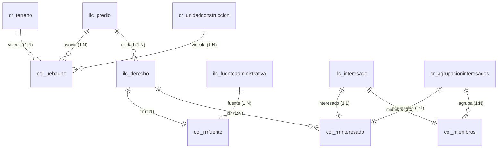

# Documento de Requerimientos Funcionales y No Funcionales

## Proyecto: GPCONES (Sistema de Catastro Integral LADM-COL)

Este documento define la especificación de requerimientos de software para **GPCONES**, una plataforma integral de gestión catastral diseñada para cumplir con el estándar **LADM-COL** (Land Administration Domain Model - Adaptación Colombia) de acuerdo con los lineamientos del Instituto Geográfico Agustín Codazzi (IGAC) y la Gobernación de Antioquia.

---

## 1. Introducción

### 1.1 Propósito
El propósito de GPCONES es proporcionar un sistema web robusto y de alto rendimiento para el levantamiento, edición, validación y consulta de información alfanumérica y geográfica de predios. La plataforma facilita la digitalización y administración de la tenencia de la tierra por parte de reconocedores prediales, digitadores y revisores de calidad catastral.

### 1.2 Alcance del Sistema
GPCONES unifica la gestión alfanumérica tradicional (fichas, propietarios, construcciones, calificaciones) con la visualización gráfica de linderos. El sistema adapta su modelo de datos en tiempo real para operar tanto con bases de datos catastrales simplificadas (esquema público) como con esquemas extendidos LADM-COL (esquemas dinámicos por municipio) mediante traducciones automáticas de consultas PostgreSQL y PostGIS.

---

## 2. Arquitectura de Datos y Relaciones LADM-COL

El modelo de datos se estructura bajo los principios de la norma ISO 19152 (LADM), adaptada a la legislación colombiana (LADM-COL). A continuación se describe el flujo de relaciones espaciales y alfanuméricas:

### 2.1 Componentes Principales
1. **BAUnit (Basic Administrative Unit - `ilc_predio`/`lc_predio`)**: Representación abstracta del predio alfanumérico. Contiene NPN, matrícula inmobiliaria, círculo ORIP y destino económico.
2. **Unidad Espacial (Spatial Unit - `cr_terreno`, `cr_unidadconstruccion`)**: Entidades geométricas que contienen el polígono físico. Las coordenadas se almacenan en el sistema de referencia de Colombia (EPSG:3116 / 9377) y se transforman dinámicamente a WGS 84 (EPSG:4326) para su renderizado web.
3. **Unión de Unidades (`col_uebaunit`)**: Tabla de asociación que vincula el predio (`baunit`) con su respectiva unidad de terreno (`ue_cr_terreno` / `ue_lc_terreno`) y sus unidades de construcción (`ue_cr_unidadconstruccion` / `ue_lc_construccion`).
4. **Relación RRR (Rights, Restrictions, Responsibilities - `ilc_derecho`, `ilc_fuenteadministrativa`, `ilc_interesado`)**: Vínculo jurídico que une al predio con sus titulares a través de un derecho (e.g., Dominio, Posesión) sustentado en una fuente documental (e.g., Escritura Pública).

---

## 3. Requerimientos Funcionales (RF)

### 3.1 RF-01: Gestión y Registro de Predios (BAUnits)
- **Descripción**: El sistema debe permitir la creación, modificación y eliminación catastral de registros de predios.
- **Detalle de Reglas**:
  - **Validación de NPN**: El Número Predial Nacional (NPN) debe tener **exactamente 30 dígitos numéricos**. No se permiten letras, caracteres especiales, ni longitudes diferentes.
  - **Identificador**: El sistema debe admitir tanto UUIDs autogenerados (esquemas públicos) como números enteros secuenciales (`t_id` de Postgres) en esquemas LADM-COL.
  - **Asociación de Municipio y Esquema**: Al registrar un predio, se debe resolver automáticamente el esquema base de datos catastral (`targetSchema`) asignado a ese municipio de trabajo. Si no está mapeado, se guardará en `public.predios`.
  - **Deshabilitación de Llaves**: Una vez creado el predio, el campo de municipio/esquema de base de datos no debe ser editable para preservar la integridad referencial.

### 3.2 RF-02: Búsqueda y Filtrado Catastral Avanzado
- **Descripción**: El usuario debe poder realizar consultas parametrizadas sobre el inventario catastral del esquema seleccionado.
- **Detalle de Filtros**:
  - Filtro por coincidencia parcial de NPN.
  - Filtro exacto por Número de Ficha catastral y Matrícula Inmobiliaria.
  - Filtro por tipo de documento del propietario (CC, NIT, CE, TI, RC, Pasaporte) y número de documento.
  - Filtro por estado catastral (Borrador, En Revisión, Aprobado, Rechazado).
  - Filtro por tipo de predio (Urbano, Rural, Mixto) y destino económico.
  - Paginación dinámica configurable en cuadrículas de 15, 30, 50, 100 y 200 filas.

### 3.3 RF-03: Gestión de Propietarios y Derechos LADM-COL
- **Descripción**: Permite registrar y editar la información de los titulares de derechos sobre el predio.
- **Detalle de Reglas**:
  - **Propietarios Directos y Agrupaciones**: Se deben soportar personas naturales/jurídicas individuales y agrupaciones (copropiedades).
  - **Cálculo Real de Participación**: La interfaz debe calcular y mostrar el porcentaje real de participación del propietario directo leyendo dinámicamente la columna `fraccion_derecho` de la tabla de derechos del esquema (multiplicado por 100 para la vista de usuario).
  - **Creación Dinámica de Columnas**: Si el esquema activo LADM-COL no posee la columna `fraccion_derecho`, el backend debe alterarse de forma transaccional (`ALTER TABLE`) para agregar la columna y soportar la edición de porcentajes de derecho en fracciones de coma flotante.
  - **Validación del 100%**: El sistema debe computar la participación total y alertar visualmente si la suma de los derechos de los propietarios no equivale exactamente al 100%.
  - **Fuentes Administrativas**: Cada derecho debe asociarse obligatoriamente a una fuente documental que detalle el número de escritura/documento, entidad emisora y fecha de escritura.

### 3.4 RF-04: Gestión de Unidades de Construcción
- **Descripción**: Permite añadir y modificar las estructuras de construcción levantadas sobre el terreno del predio.
- **Detalle de Reglas**:
  - Cada unidad de construcción debe contener campos obligatorios: identificador secuencial (ej. `UC-1`), total de plantas, año de construcción, altura en metros, planta o nivel de ubicación, área construida (m²) y uso (Habitacional, Comercial, Industrial, etc.).
  - **Inserción Geométrica Vacía**: Al agregar una construcción alfanumérica desde la UI, el backend debe registrar un polígono tridimensional vacío compatible en PostGIS (`ST_GeomFromText('MULTIPOLYGON Z EMPTY', srid)`) para evitar errores en motores GIS espaciales.
  - **Redondeo de Pisos**: Los niveles/plantas de ubicación se deben almacenar como números enteros.

### 3.5 RF-05: Calificación de Unidades de Construcción
- **Descripción**: Permite registrar la ficha técnica de características constructivas para la valuación del predio.
- **Detalle de Reglas**:
  - Soporte de tres modalidades de calificación: **Convencional**, **No Convencional** y **Tipología**.
  - Formulario estructurado en categorías técnicas:
    - **Estructura**: Armazón, Muros, Cubierta y estado de conservación de estructura.
    - **Acabados**: Fachada, Cubrimiento de muros, Pisos y estado de conservación de acabados.
    - **Baños**: Tamaño, Enchapados, Mobiliario y conservación.
    - **Cocinas**: Tamaño, Enchapados, Mobiliario y conservación.
    - **Adicionales (Uso Industrial)**: Cerchas de complemento y altura superior a 6 metros (booleano).
  - Integración dinámica con diccionarios de datos del catálogo LADM-COL (resolviendo los identificadores de tablas `cuc_` de metadatos).

### 3.6 RF-06: Visor Geográfico Integrado (Mapa)
- **Descripción**: Pestaña interactiva de detalle donde el usuario puede visualizar en tiempo real la forma, dimensiones y delimitación del predio y sus estructuras.
- **Detalle de Reglas**:
  - **Carga de Coordenadas de Terreno**: El visor debe renderizar en color verde esmeralda translúcido (`#0a5c3e`) el polígono del terreno correspondiente al predio, transformado de EPSG:3116 a EPSG:4326.
  - **Construcciones Mapeadas**: Si el predio posee huellas geográficas de construcción asociadas en `col_uebaunit`, estas se deben graficar de forma superpuesta en color terracota translúcido (`#a53d0a`).
  - **Encuadre Automático**: Mediante un componente de escucha de eventos, el mapa debe ajustar automáticamente su centro y zoom a los límites del polígono (`fitBounds`) tras cambiar de predio o pestaña.
  - **Detalle Emergente (Popups)**:
    - Al hacer clic en el terreno, se abre un popup que muestra el NPN y Número de Ficha.
    - Al hacer clic en una construcción, se abre un popup que muestra la etiqueta o identificador de la construcción.
  - **Control de Ausencia Geográfica**: Si el predio no posee registros espaciales, se debe renderizar una alerta en amarillo indicando que no cuenta con información de linderos catastrales, cargando un mapa base del territorio nacional.

### 3.7 RF-07: Dashboard y Estadísticas Catastrales
- **Descripción**: Pantalla inicial con indicadores clave de rendimiento e inventarios de predios.
- **Detalle de Reglas**:
  - Cálculo consolidado en tiempo real del Total de Predios, Área Total (hectáreas), Área Promedio (hectáreas) e histórico de Municipios Mapeados.
  - Gráfico de distribución de predios por estado de revisión.
  - **Filtrado Dinámico**: Al seleccionar un municipio de trabajo catastral, el Dashboard debe re-renderizar todas las tarjetas y estadísticas consultando únicamente las tablas del esquema LADM-COL asignado a ese municipio.

### 3.8 RF-08: Exportación de Datos
- **Descripción**: Permitir la extracción del inventario catastral filtrado para su uso en herramientas GIS externas (QGIS, ArcGIS) o de ofimática.
- **Formatos Soportados**:
  - **CSV**: Conteniendo columnas tabulares de fichas, áreas, NPN y datos de propietarios.
  - **GeoJSON**: Exportación geográfica compatible con linderos de terrenos representados en coordenadas globales.

### 3.9 RF-09: Control de Acceso Basado en Roles (RBAC)
- **Descripción**: La plataforma debe autorizar la visualización y operaciones de modificación según el perfil asignado al usuario autenticado.
- **Matriz de Permisos**:

| Rol | Ver Predios / Mapa | Editar Ficha / Calificaciones | Agregar Propietario / UC | Eliminar Predio | Cambiar Estado (Aprobar) |
| :--- | :---: | :---: | :---: | :---: | :---: |
| **Administrador del Sistema** | Sí | Sí | Sí | Sí | Sí |
| **Reconocedor Predial** | Sí | Sí | Sí | No | No |
| **Digitador Alfanumérico** | Sí | Sí (Borrador) | Sí (Borrador) | No | No |
| **Revisión de Calidad** | Sí | No | No | No | Sí |

### 3.10 RF-10: Auditoría de Transacciones
- **Descripción**: El sistema debe registrar las operaciones críticas realizadas por los usuarios para efectos de trazabilidad catastral.
- **Eventos Auditados**: Creación de predio, modificación de ficha catastral, cambios en porcentajes de derecho de propietarios, y eliminación de registros.

---

## 4. Requerimientos No Funcionales (RNF)

### 4.1 RNF-01: Usabilidad y Estética Premium
- **Alineación Visual**: Interfaz web moderna con estilo de diseño limpio, bordes suavizados, sombras sutiles y esquemas de colores HSL.
- **Tipografía**: Incorporación de fuentes de alta legibilidad (interfaz basada en fuentes tipo *Inter*, *Outfit* o similares de Google Fonts).
- **Animaciones**: Micro-animaciones fluidas en botones, tarjetas, transiciones de menús y spinners de carga personalizados de color verde esmeralda.
- **Responsividad**: Diseño adaptable a pantallas de computadoras de escritorio y tablets para su uso en trabajo de campo catastral.

### 4.2 RNF-02: Rendimiento y Eficiencia
- **Indexación Espacial**: Las consultas geográficas sobre polígonos de terrenos y construcciones deben hacer uso obligatorio de índices espaciales GIST en PostgreSQL/PostGIS (`idx_lc_terreno_geometria`, `idx_lc_construccion_geometria`).
- **Tiempo de Respuesta**: Las API alfanuméricas de listado catastral deben retornar en un tiempo menor a 500ms para consultas de hasta 1,000 predios.
- **Traducción en Caliente**: Las traducciones automáticas de nombres de tablas y columnas físicas (`translateToStandard`) de esquemas dinámicos LADM-COL no deben penalizar el tiempo de respuesta del backend por más de 5ms.

### 4.3 RNF-03: Interoperabilidad y Adaptabilidad Catastral
- **Compatibilidad de Modelos**: Adaptabilidad transparente a esquemas estandarizados generados por la herramienta de importación `ili2pg` (ej. nombres de tablas con prefijo `lc_`) y esquemas no estandarizados (ej. nombres de tablas con prefijo `ilc_`).
- **Codificación de Base de Datos**: Intercambio de datos alfanuméricos configurado estrictamente en formato UTF-8 a nivel de base de datos para evitar corrupciones de caracteres especiales del español (tildes, eñes).

### 4.4 RNF-04: Seguridad y Consistencia
- **Autenticación**: Acceso protegido mediante JSON Web Tokens (JWT) expirables transmitidos en las cabeceras HTTP de autorización.
- **Transaccionalidad**: Las modificaciones catastrales compuestas (ej. crear un predio y su terreno geométrico simultáneamente) deben ejecutarse en bloques de transacción SQL únicos (`BEGIN ... COMMIT`) para garantizar consistencia ante fallos.
- **Control de Condiciones de Carrera**: El frontend debe rastrear y cancelar peticiones de datos catastrales antiguas si el usuario selecciona un esquema o municipio diferente antes de que finalice la carga de la petición anterior.
